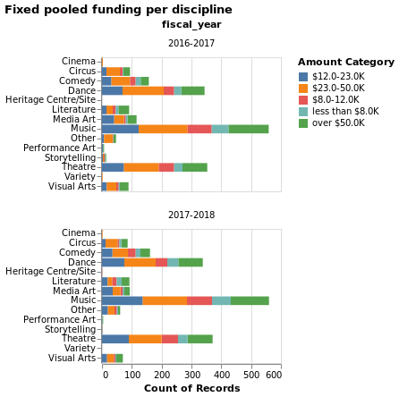
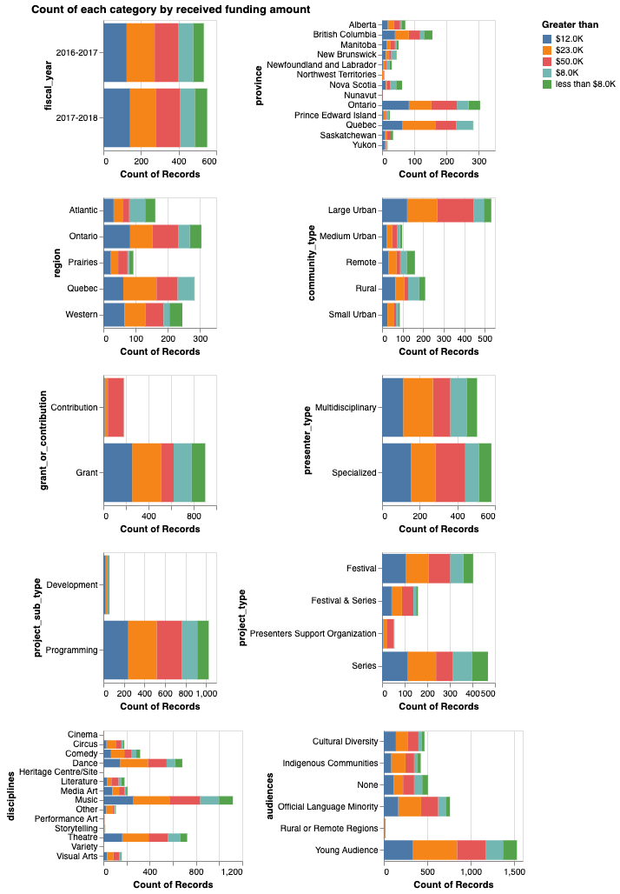

Prediction of the Canadian Heritage Funding Size for Art Projects
================
Wenxin Xiang
Last update: 2022-01-22

-   [Audiance persona for the target
    reader](#audiance-persona-for-the-target-reader)
-   [Abstract](#abstract)
-   [Introduction](#introduction)
-   [Methods](#methods)
    -   [Data](#data)
    -   [Data Analysis](#data-analysis)
-   [Results](#results)
-   [Conclusion](#conclusion)
-   [References](#references)

# Abstract

Heritage conservation is considered highly important in Canadian
society. The identification, protection and promotion of culture and
history could be conducted through the form of art presentation and
support to arts presenters. The Canada Arts Presentation Fund (CAPF) is
the funding organization that provides financial assistance to support
those organizations and artists. The applicants for the fund are
interested in how much they will be granted given information
non-indicative of artistic merit. To help predict the funding size given
historical information of funding size granted in previous years and the
information of those receivers, we collected data on funding provided in
2016-2017 and 2017-2018. During inital exploratory data analysis, we
found that the distribution of funding size was not continuous but with
gradients. We transformed the prediction from a regression problem to a
multiclass classification problem by categorizing funding sizes into
ranges. Then we used machine learning algorithm, Random Forest, to learn
and get trained on training dataset, and then get tested and predict the
funding size granted. Our model performed reasonably well comparing to
the base line with a weighted-average f-1 score of 0.69, weighted
precision score of 0.69, and weighted recall score of 0.69. The machine
learning model we created could help predict the size of funding that
will be granted based on the information of applicants, including city,
province, community type, diciplines, presenter type, audiences type,
etc. without looking into details about the specific organization name.
The model could be trained on funding history and make prediction on
future application projects. However more care could have been taken to
the categorization on the funding ranges, as we noticed that the model
performed less well on classifying funding size in range of $12.0-23.0K
and $23.0-50.0K comparing to classifying funding sizes of other ranges.
We suggest further study to improve this classification problem and
improve the performance of the model.

# Introduction

Heritage conservation has a place in contemporary Canadian society for
it connects to the history roots. The interest in heritage conservation
has been growing. It’s widely recognized by the Canadian society that
conservation movement is widely needed on managing valued cultural and
historical assets that can be successfully passed on to succeeding
generations unimpaired (Fulton 2015).

Amid controversies over governmental involvements in arts, the Canada
Council for the Arts (the Council) has been fostering creativity through
allocating government funding to selected art projects. The Council’s
judging criteria emphasizes artistic merit instead of social and
political influences(Santini 2013). The funding sources available in
Canada from government including the Canada Arts Presentation Fund, and
the Canada Cultural Spaces Fund (Canada 2018). Among those, the Canada
Arts Presentation Fund (Heritage 2021) under the Department of Canadian
Heritage (DCH) is a special one to financially support those
organizations that professionally present arts in festivals or provide
support to art presenters. The Fund’s performance is mainly evaluated
based on the diversity of the grantees or awardees instead of artistic
merit. Therefore, it’s in the interest of Canadian heritage supporters
and fund grantees to predict the funding size based on the features not
indicative of specific information about the application organizations,
but those reflecting social, cultural, and geographical diversity.  
In this project, we planed to answer the intriguing questions:

> Given the information non-indicative of artistic merit, like region,
> audience type, discipline etc., could we make prediction on the
> funding size to be granted on art projects?

> Could we create a machine learning model to make prediction on funding
> size to be granted in the future given information of funding history?

The significance of answering the questions lies in our unanimous
support for preserving Canadian heritage through artistic expressions.
We would like to get more insights about how the funding is allocated
and help applicants have a better understanding of the fund and plan for
the financial budgeting and staffing for the incoming year.

Through preliminary research, we found researchers trying to build
machine learning model to predict business success using models logistic
regression, support vector machine, and the gradient boosting classifier
(Żbikowski and Antosiuk 2021). The reported model precision, recall, and
F1 scores for the best model, gradient boosting classifier, were 57%,
34% and 43% respectively. (Ross et al. 2021) reported that they
developed machine-learning model to predict the outcome of startups as a
prescreening on potential investments using publicly available
information. These research gave us idea that similar model could be
adapted into our case to create models to predict the funding size of
Canadian Heritage Funds. We found that there’s no exact model that
applied on the funding prediction related to arts and culture. It’s
feasible and of good value to create such a model using machine learning
algorithms such as Logistic Regression, Naive Bayes, Support Vector
Classification, and Random Forest.

# Methods

In this study we collected data from the Department of Canadian Heritage
(DCH) available on the Government of Canada’s Open Data
[website](https://open.canada.ca/data/en/dataset/92984c11-6fd4-40c4-b23c-e8832e1f4cd5).
There were 1358 samples collected in the data set including information
of fund awardees during the year of 2016-2018.

## Data

Each row of the data set represented an art project funded by the Fund
and provides basic information such as the project’s name, location
information (community, city, region and province), presenter
information (associated organizations, disciplines, festival or series
presentations, etc.), grant or contribution, and audience. The size of
the funding approved for each art project was denoted as
`amount_approved` column, which was our target.

We firstly checked the missing values and outliers and conducted
preliminary data cleaning including rename columns, clean the data type
of columns, and tidy the data table. After data cleaning we conducted
train and test data splitting with 20% test data and 80% training data.
Then we conducted exploratory data analysis (EDA) to explore the data
distribution.

Originally we considered building the prediction model with regression
algorithm given the fact the target, funding size denoted as
`amount_approved`, is numeric. After the initial EDA, we observed that
the `amount_approved` in the original data set is not continuous.
Therefore, we divided the values into five categories:
`less than $8.0k`, `$8.0k-12.0k`, `$12.0-23.0k`, `$23.0k-50.0k`, and
`over 50k`, which stood for the funding size in the range of 8k to 10k,
12k to 23k, 23k to 50k, and larger than 50 k in CAD respectively. They
were divided into five categories based on 10%, 25%, 50% and 75%
percentile of the data in the `amount_approved` column.

We dropped the feature `fiscal_year` because the distributions for arts
in each discipline across funding sizes stayed the same year over year.
This also showed the potential of using the historical funding
allocation data to predict future funding size allocation. See the
Figure 1 below for detailed distributions:

We dropped feature `region` from the original data for the repetitive
representation of the feature already described in another feature
`province`. We also dropped `organization_name` because there were many
unique organization names. They were not meaningful in terms of building
a model aimd at prediction on deployment data. We would like to build a
model that can learn information more generic, and more applicable on
wide variety of organizations. The features `disciplines_other` and
`Audiences_none` were dropped because the features were not informative.

We explored the distribution of the target, the funding size approved.
According to Table 1, we have observed some class imbalance but it was
not too concerning given the imbalance was moderate and we had 5
classes.

<table class="table" style="margin-left: auto; margin-right: auto;">
<caption>
Count of each funding size. Observed class imbalance
</caption>
<thead>
<tr>
<th style="text-align:left;">
Funding Size
</th>
<th style="text-align:right;">
Count
</th>
</tr>
</thead>
<tbody>
<tr>
<td style="text-align:left;">
$12.0-23.0K
</td>
<td style="text-align:right;">
266
</td>
</tr>
<tr>
<td style="text-align:left;">
$23.0-50.0K
</td>
<td style="text-align:right;">
288
</td>
</tr>
<tr>
<td style="text-align:left;">
$8.0-12.0K
</td>
<td style="text-align:right;">
161
</td>
</tr>
<tr>
<td style="text-align:left;">
less than $8.0K
</td>
<td style="text-align:right;">
121
</td>
</tr>
<tr>
<td style="text-align:left;">
over $50.0K
</td>
<td style="text-align:right;">
250
</td>
</tr>
</tbody>
</table>

To further confirm the features included in our model were meaningful we
conducted EDA on Count of each category by received funding amount. See
the figure 2 blow:

We can find from the figure that the `province`, `community_type`,
`grant_type`, `presenter_type`, `project_sub_type`, `project_type`,
`disciplines`, and `audiences` included as features in our model all
showed influence on the distribution of the funding size. Other than
`fiscal_year`, `region`, `disciplines_other`, and “`organization_name`,
all features in the original data set were used to fit the models.

## Data Analysis

Initially, four algorithms, Logistics regression, Naive Bayes, Support
Vector Classification (SVC) and Random Forest were used to build
multi-class classification model to classify the size of the funding.
The dummy Classifier was used to plot the baseline of the prediction
model.

The Python programming languages (Van Rossum and Drake 2009) and the
following Python packages were used to perform the analysis: numpy
(Harris et al. 2020), pandas (McKinney et al. 2010), scikitlearn
(Pedregosa et al. 2011). The code used to perform the analysis and
create this report can be found here:
<https://github.com/UBC-MDS/canadian_heritage_funding>.

The features were preprocessed using data pipelines. The `project_name`
was processed as text data and passed through `CountVectorizer`. The
`community_type` was treated as ordinal feature, and all other features
included were treated as categorical features.

We used weighted f1 score, weighted recall score and weighted precision
score as scoring metrics to evaluate model performance and conducted
model selection. The higher were those scores, the better the model
performed. The table below showed model performance. The Random Forest
model presented highest f1, recall and precision scores.

<table class="table table" style="margin-left: auto; margin-right: auto; margin-left: auto; margin-right: auto;">
<caption>
Performance comparison of all models. Random Forest performs the best.
</caption>
<thead>
<tr>
<th style="text-align:left;">
</th>
<th style="text-align:right;">
Dummy Classifier
</th>
<th style="text-align:right;">
Logistic Regression
</th>
<th style="text-align:right;">
Multinomial Naive Bayes
</th>
<th style="text-align:right;">
SVC
</th>
<th style="text-align:right;">
Random Forest
</th>
</tr>
</thead>
<tbody>
<tr>
<td style="text-align:left;">
test_f1_weighted
</td>
<td style="text-align:right;">
0.11
</td>
<td style="text-align:right;">
0.57
</td>
<td style="text-align:right;">
0.44
</td>
<td style="text-align:right;">
0.52
</td>
<td style="text-align:right;">
0.63
</td>
</tr>
<tr>
<td style="text-align:left;">
test_recall_weighted
</td>
<td style="text-align:right;">
0.27
</td>
<td style="text-align:right;">
0.57
</td>
<td style="text-align:right;">
0.45
</td>
<td style="text-align:right;">
0.52
</td>
<td style="text-align:right;">
0.63
</td>
</tr>
<tr>
<td style="text-align:left;">
test_precision_weighted
</td>
<td style="text-align:right;">
0.07
</td>
<td style="text-align:right;">
0.58
</td>
<td style="text-align:right;">
0.47
</td>
<td style="text-align:right;">
0.53
</td>
<td style="text-align:right;">
0.64
</td>
</tr>
</tbody>
</table>

After selecting the optimal model, we conducted hyperparameter
optimization to further improve model performance with random search
cross validation (5 folds cross validation). The hyperparameter that
made model approaching the best cross validation weighted f1 score were
`max_features=800` for `CountVectorizer()`, `max_features='auto'`,
`max_depth=30`, and `class_weight='balance'` for
`RandomForestClassifier()`.

# Results

We tested the prediction model on the test data to evaluate the model
generalization performance. The table below showed the precision,
recall, f1 and accuracy scores on different classes. The model performed
reasonably well comparing with other model tested in this study and
baseline.

Overall, the weighted average recall score was 0.69, the weighted
average precision score was 0.69, the weighted f1 score was 0.69, and
the model accuracy was 0.69. The
$Precision = \\frac{True Positive}{True Positive + False Positive}$, and
the $Recall = \\frac{True Positive}{True Positive + False Negative}$,
$F1 = 2 \\times \\frac{Precision \\times Recall}{Precision + Recall}$.
The precision score is a measurement of the cost of False Positive while
recall score is a measure of the cost False Negative. From the result of
our model, we can see that the recall scores and precision scores were
very close, which meant that we got a good balance of precision and
recall. The accuracy score showed that the model could predict with 69%
correct funding size based on the information of project name, location
of project, disciplines, audiences type etc. provided.

Further, we observed that the model was better at classifying funding
size in the range of `less than $8.0k`, `$8.0K-$12.0K` and `over $50K`.
This may be caused by the class imbalance because we have more funding
sizes in range of `$12.0-23.0K` and `$23.0-50.0K`. We might be able to
improve the model by adjusting the target classes to make the
distribution more balanced. We might also want to look further into
other classifiers such as k-Nearest Neighbors to see if the scores will
be improved.

<table class="table" style="margin-left: auto; margin-right: auto;">
<caption>
Test scores for the best model
</caption>
<thead>
<tr>
<th style="text-align:left;">
</th>
<th style="text-align:right;">
precision
</th>
<th style="text-align:right;">
recall
</th>
<th style="text-align:right;">
f1-score
</th>
</tr>
</thead>
<tbody>
<tr>
<td style="text-align:left;">
$12.0-23.0K
</td>
<td style="text-align:right;">
0.61
</td>
<td style="text-align:right;">
0.60
</td>
<td style="text-align:right;">
0.60
</td>
</tr>
<tr>
<td style="text-align:left;">
$23.0-50.0K
</td>
<td style="text-align:right;">
0.58
</td>
<td style="text-align:right;">
0.63
</td>
<td style="text-align:right;">
0.61
</td>
</tr>
<tr>
<td style="text-align:left;">
$8.0-12.0K
</td>
<td style="text-align:right;">
0.74
</td>
<td style="text-align:right;">
0.68
</td>
<td style="text-align:right;">
0.71
</td>
</tr>
<tr>
<td style="text-align:left;">
less than $8.0K
</td>
<td style="text-align:right;">
0.79
</td>
<td style="text-align:right;">
0.70
</td>
<td style="text-align:right;">
0.74
</td>
</tr>
<tr>
<td style="text-align:left;">
over $50.0K
</td>
<td style="text-align:right;">
0.81
</td>
<td style="text-align:right;">
0.83
</td>
<td style="text-align:right;">
0.82
</td>
</tr>
<tr>
<td style="text-align:left;">
accuracy
</td>
<td style="text-align:right;">
0.69
</td>
<td style="text-align:right;">
0.69
</td>
<td style="text-align:right;">
0.69
</td>
</tr>
<tr>
<td style="text-align:left;">
macro avg
</td>
<td style="text-align:right;">
0.70
</td>
<td style="text-align:right;">
0.69
</td>
<td style="text-align:right;">
0.70
</td>
</tr>
<tr>
<td style="text-align:left;">
weighted avg
</td>
<td style="text-align:right;">
0.69
</td>
<td style="text-align:right;">
0.69
</td>
<td style="text-align:right;">
0.69
</td>
</tr>
</tbody>
</table>

# Conclusion

In this study, we built a multiclass classification model which can use
features not indicative of artistic merit, such as location, audience,
and discipline to predict the funding size granted by the Canada Arts
Presentation Fund (CAPF). This model was trained on historical funding
allocation data and could be used to predict future funding size given
the funding allocation is consistent over years. We tried four popular
algorithms for classification questions, including Logistics regression,
Naive Bayes, Support Vector Classification (SVC) and Random Forest
initially, and selected Random Forest as the best algorithm for our
question based on model’s cross-validation scores. Our model could
predict the funding size ranges with 69% chance that the prediction is
correct based on accuracy score on the test data. The features not
indicative of artist merit can be used to predict funding size granted.
Funding applicants will benefit from the model to help plan their future
financial budgeting and presenter recruitment.

However, there’s room for improvement on model performance. We observed
that the model performed better at classifying funding size in the range
of `less than $8.0k`, `$8.0K-$12.0K` and `over $50K`. This may be caused
by the class imbalance because we have more funding sizes in the range
of `$12.0-23.0K` and `$23.0-50.0K`. We might want to adjust the ranges
of funding size to have more balanced classes. Or we can try on other
classifiers to find a more suitable machine learning algorithm for this
type of dataset.

We also see there’s a potential for deploying this strategy using
machine learning algorithm for funding size prediction on other
government financial support programs to Canadian heritage conservation.

# References

Canada, Government of. 2018. “Data on Funding Provided in 2016-2017 and
2017-2018 by the Canada Arts Presentation Fund, Canadian Heritage.”
*Government of Canada*.
<https://open.canada.ca/data/en/dataset/92984c11-6fd4-40c4-b23c-e8832e1f4cd5>.

Fulton, Gordon. 2015. “Heritage Conservation.” *The Canadian
Encyclopedia*.
<https://www.thecanadianencyclopedia.ca/en/article/heritage-conservation>.

Harris, Charles R., K. Jarrod Millman, Stéfan J van der Walt, Ralf
Gommers, Pauli Virtanen, David Cournapeau, Eric Wieser, et al. 2020.
“Array Programming with NumPy.” *Nature* 585: 357–62.
<https://doi.org/10.1038/s41586-020-2649-2>.

Heritage, Canadian. 2021. “Government of Canada.” *Canada.ca*.
Government of Canada.
<https://www.canada.ca/en/canadian-heritage/services/funding/arts-presentation-fund.html>.

McKinney, Wes et al. 2010. “Data Structures for Statistical Computing in
Python.” In *Proceedings of the 9th Python in Science Conference*,
445:51–56. Austin, TX.

Pedregosa, Fabian, Gaël Varoquaux, Alexandre Gramfort, Vincent Michel,
Bertrand Thirion, Olivier Grisel, Mathieu Blondel, et al. 2011.
“Scikit-Learn: Machine Learning in Python.” *Journal of Machine Learning
Research* 12 (Oct): 2825–30.

Ross, Greg, Sanjiv Das, Daniel Sciro, and Hussain Raza. 2021.
“CapitalVX: A Machine Learning Model for Startup Selection and Exit
Prediction.” *The Journal of Finance and Data Science* 7: 94–114.

Santini, Lauryn. 2013. “Public Funding of the Visual Arts in Canada:
Keeping Creativity at an Arm’s Length.” PhD thesis, Sotheby’s Institute
of Art-New York.

Van Rossum, Guido, and Fred L. Drake. 2009. *Python 3 Reference Manual*.
Scotts Valley, CA: CreateSpace.

Żbikowski, Kamil, and Piotr Antosiuk. 2021. “A Machine Learning,
Bias-Free Approach for Predicting Business Success Using Crunchbase
Data.” *Information Processing & Management* 58 (4): 102555.

